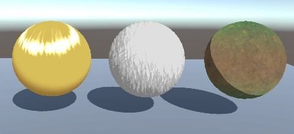

# URP Toon Shader (Custom)

A collection of custom shaders made with [URP Toon Shader](https://github.com/Delt06/urp-toon-shader).

## List of custom shaders

- Additive matcap

- Hand-drawn ramp

- Triplanar mapping

- Vertex animation

## Implementation

The project uses custom shader generation functionality of URP Toon Shader.
The original shader provides several points where code can be injected to, which allows implementing custom behavior on top of the base shader.